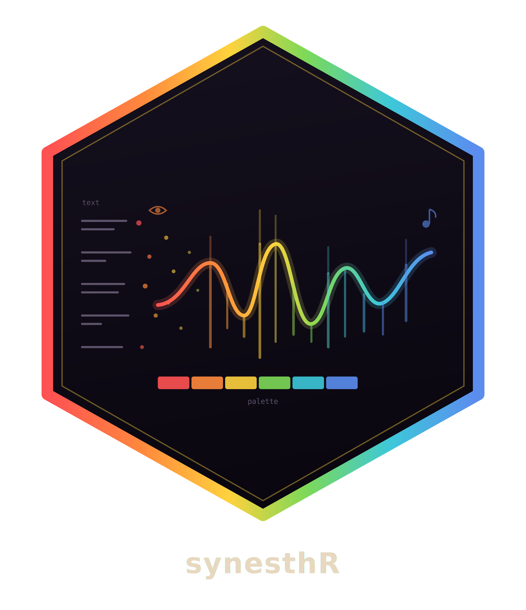
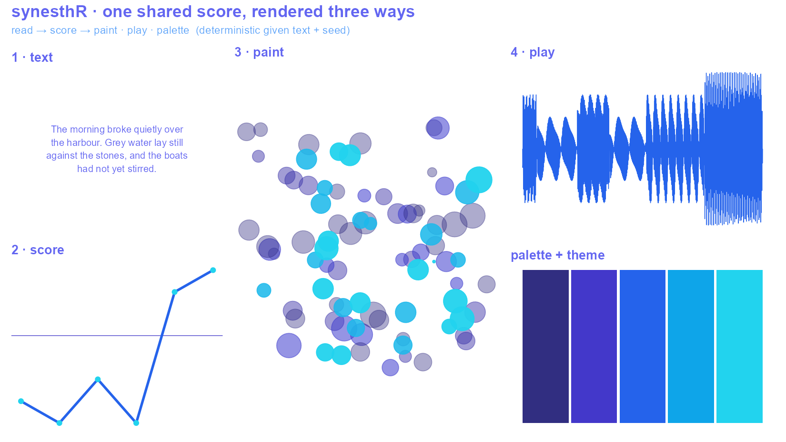
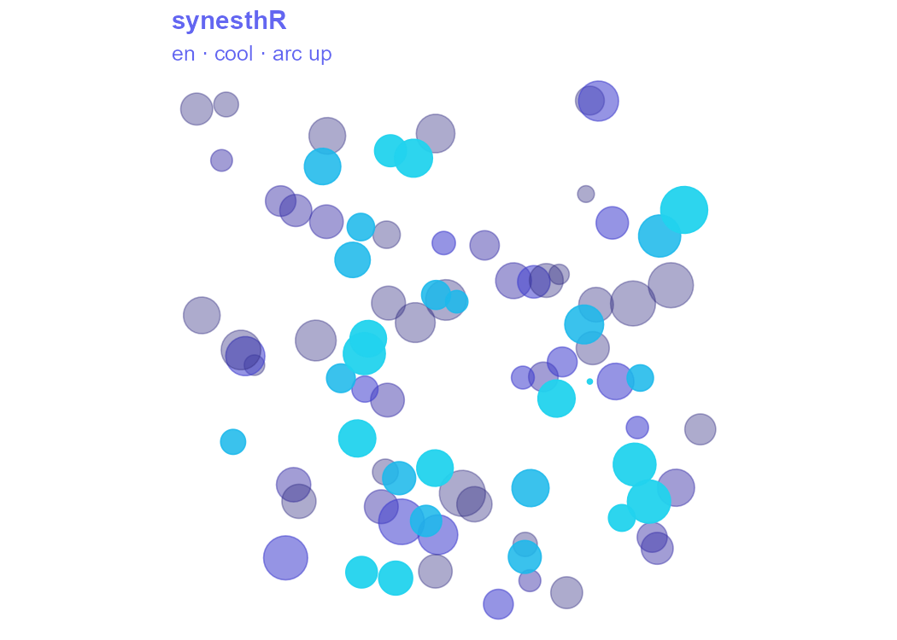

<!-- README.md is generated from README.Rmd. Please edit that file -->

# synesthR 

<!-- badges: start -->

[](https://github.com/r-heller/synesthR/actions/workflows/R-CMD-check.yaml)
[](https://app.codecov.io/gh/r-heller/synesthR)
[](https://lifecycle.r-lib.org/articles/stages.html#experimental)
<!-- badges: end -->

**synesthR** turns literary text (German, English, French) into
synchronized generative images and music. It extracts a sentence-level
sentiment arc, lexical diversity, rhythm, and punctuation density into a
single *prosody score*, then maps that score deterministically onto both
a still image and a synchronized audio waveform — so the picture and the
music are two views of the same analysis. Colour palettes and `ggplot2`
themes can be extracted from text, images, or audio through one
interface, and an optional local-LLM layer can interpret the result.

## How it works

One shared score, rendered three ways — the same numbers become a picture, a
piece of audio, and a colour palette:



## Installation

``` r
# install.packages("pak")
pak::pak("r-heller/synesthR")
```

## Usage

``` r
library(synesthR)

text  <- syn_read_text(syn_example_text("en"), lang = "en")
score <- syn_score(text)
score
#> <prosody_score> — 6 sentences, lang "en"

# syn_paint() returns a ggplot, so it restyles like any other — here in the
# site's blue palette on a transparent canvas
blues <- c("#312E81", "#4338CA", "#2563EB", "#0EA5E9", "#22D3EE")
syn_paint(score) +
  ggplot2::scale_colour_gradientn(colours = blues) +
  ggplot2::theme(text             = ggplot2::element_text(colour = "#6366F1"),
                 plot.title       = ggplot2::element_text(colour = "#6366F1", face = "bold"),
                 plot.background  = ggplot2::element_rect(fill = NA, colour = NA),
                 panel.background = ggplot2::element_rect(fill = NA, colour = NA))
```



``` r
wav <- syn_write_wav(score, tempfile(fileext = ".wav"))

# a palette and matching ggplot2 theme, from the same score
syn_palette(score)
#> <syn_palette> - 5 colours, cool, from prosody_score
#> "#294D00" background
#> "#207900" shadow
#> "#00A65D" mid
#> "#00D5A4" accent
#> "#3BFFEB" highlight
```

The core (`read -> score -> map -> paint/play/palette/media`) is pure R,
deterministic given `(text, seed)`, and requires no external software.
Optional extensions (image/audio palettes via `magick`/`seewave`,
animation via `gganimate`, engraved scores via `gm`, a local LLM via
`ellmer`, and Python interop via `reticulate`) live in `Suggests` and
degrade gracefully when absent.

## License

MIT © Raban Heller
